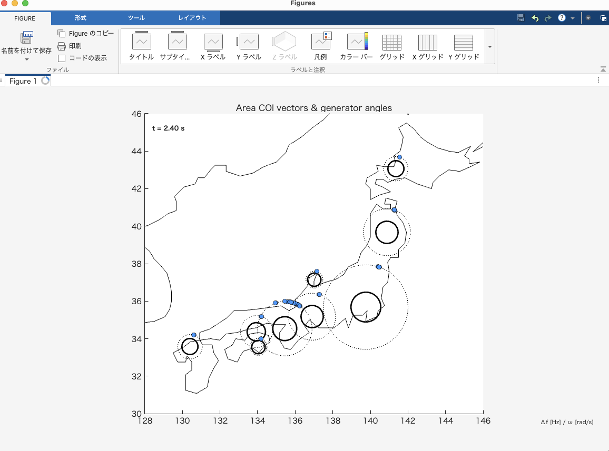
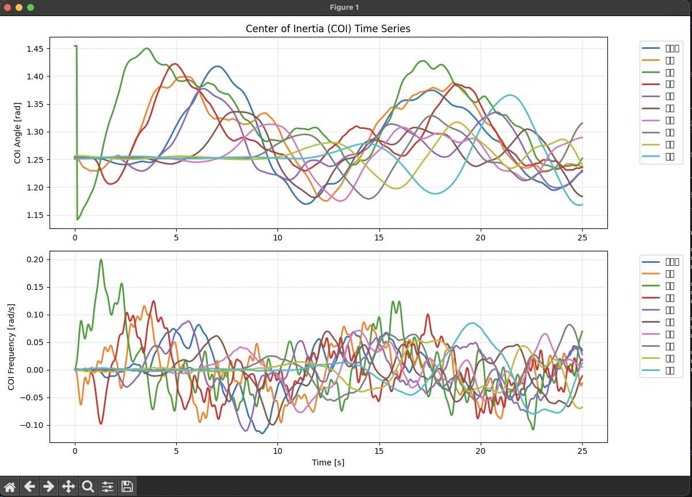

# Japan_Swing


日本の10エリア（北海道〜沖縄）の電力系統における連成スイング（同期安定性）をシミュレーションするプログラムです。

**MATLAB版とPython版の両方を提供しています。**

## 概要

このプロジェクトは、日本の電力系統を10の地域エリアに分割し、各エリア内の発電機群の動的な挙動を連成スイング方程式で解析します。地理的な位置情報と合わせて、リアルタイムで同期安定性を可視化できます。

## クイックスタート

**Python版（推奨）**
```bash
git clone https://github.com/lutelute/Japan_Swing.git
cd Japan_Swing/python
python3 -m venv venv
source venv/bin/activate
pip install -r requirements.txt
python simulate_area_network.py
```

**MATLAB版**
```bash
git clone https://github.com/lutelute/Japan_Swing.git
cd Japan_Swing/matlab
python generate_area_template.py  # 初回のみ
# MATLABでsimulate_area_networkを実行
```

## 機能

- 10エリア（北海道、東北、東京、北陸、中部、関西、中国、四国、九州、沖縄）の連成解析
- エリア別の発電機台数設定（可変対応）
- 任意のエリア・発電機への擾乱投入
- 地理マップ上でのCOI（Center of Inertia）ベクトルと発電機角度の可視化
- Excelテンプレートによるパラメータ管理

## ファイル構成

```
Japan_Swing/
├── matlab/
│   ├── simulate_area_network.m         # メインシミュレーションスクリプト (MATLAB)
│   ├── generate_area_template.py       # Excelテンプレート生成スクリプト
│   ├── area_parameters_template.xlsx   # パラメータ設定ファイル
│   └── ~$area_parameters_template.xlsx # Excelテンポラリファイル
├── python/
│   ├── simulate_area_network.py        # メインシミュレーションスクリプト (Python)
│   ├── generate_area_template.py       # Excelテンプレート生成スクリプト
│   ├── requirements.txt                # Python依存関係
│   ├── run.sh                          # 実行スクリプト (Linux/macOS)
│   ├── run.bat                         # 実行スクリプト (Windows)
│   ├── README_python.md                # Python版詳細説明
│   └── venv/                           # 仮想環境（自動生成）
└── README.md
```

## 使用方法

### 1. 環境要件

#### MATLAB版
- MATLAB (Curve Fitting Toolbox、Mapping Toolboxが推奨)
- Python 3.x (pandas, xlsxwriter) - テンプレート生成用

#### Python版
- Python 3.8以上
- pip (パッケージ管理)

### 2. 実行手順

#### MATLAB版

1. **パラメータテンプレート生成**（初回のみ）
   ```bash
   cd matlab
   python generate_area_template.py
   ```

2. **シミュレーション実行**
   ```matlab
   cd matlab
   simulate_area_network
   ```

#### Python版

1. **初期設定**（初回のみ）
   ```bash
   cd python
   
   # 仮想環境作成
   python3 -m venv venv
   
   # 仮想環境をアクティベート
   source venv/bin/activate  # Linux/macOS
   # または
   venv\Scripts\activate     # Windows
   
   # 依存ライブラリをインストール
   pip install -r requirements.txt
   ```

2. **シミュレーション実行**
   ```bash
   cd python
   
   # 仮想環境をアクティベート
   source venv/bin/activate
   
   # シミュレーション実行
   python simulate_area_network.py
   
   # 実行後は仮想環境をデアクティベート
   deactivate
   ```

   **簡単実行（推奨）**
   ```bash
   cd python
   ./run.sh     # Linux/macOS
   run.bat      # Windows
   ```

   **実行手順のデモ**
   
   
   *GIF: Python版シミュレーションの実行手順とインターフェースの動作例*

#### 3. 実行時の設定（共通）
   - 可視化対象エリアを選択
   - 擾乱を投入するエリアと発電機番号を指定
   - 擾乱量（$\Delta\delta$ [rad]）を設定

#### 4. 版の違い

| 項目 | MATLAB版 | Python版 |
|------|----------|----------|
| **インターフェース** | GUIダイアログ | コンソール入力 |
| **可視化** | MATLAB図形 | matplotlib |
| **依存関係** | MATLABツールボックス | Pythonライブラリ |
| **実行方法** | MATLABコマンド | Pythonスクリプト |
| **メモリ効率** | 高 | 中 |
| **カスタマイズ性** | 中 | 高 |

#### 5. トラブルシューティング

**Python版でよくある問題:**

- **仮想環境が見つからない**: `python3 -m venv venv`で仮想環境を作成してください
- **ライブラリエラー**: 仮想環境がアクティベートされているか確認してください
- **可視化が表示されない**: GUI環境でPythonを実行しているか確認してください
- **パーミッションエラー**: `chmod +x run.sh`でスクリプトに実行権限を付与してください

### 3. パラメータ調整

`area_parameters_template.xlsx`を編集することで以下のパラメータを調整できます：

- `Generator_Count`: エリア内発電機台数
- `p_m`: 機械的入力パワー $P_m$
- `b`: 同期化力係数 $B$
- `b_int`: エリア内結合係数 $B_{int}$
- `epsilon`: エリア間結合強度 $\varepsilon$
- `Connection_Coeff`: エリア間接続係数

## シミュレーション詳細

### モデル

各発電機の動特性は以下の連成スイング方程式で表現されます：

$$
\begin{align}
\frac{d\delta}{dt} &= \omega \\
\frac{d\omega}{dt} &= P_m - B \sin(\delta) - B_{int}[\sin(\delta-\delta_{prev}) + \sin(\delta-\delta_{next})] - \varepsilon B_{int} g
\end{align}
$$

ここで：
- $\delta$: 発電機角度 [rad]
- $\omega$: 角速度 [rad/s]
- $P_m$: 機械的入力パワー [p.u.]
- $B$: 同期化力係数 [p.u.]
- $B_{int}$: エリア内結合係数 [p.u.]
- $\varepsilon$: エリア間結合強度 [p.u.]
- $g$: エリア間相互作用項 [p.u.]

### 可視化

シミュレーションでは以下の要素をリアルタイムで可視化します：

- **日本地図**: 10エリアの地理的な位置関係を表示
- **COI（Center of Inertia）ベクトル**: 各エリアの平均的な動的状態をベクトルで表示
- **発電機角度**: 個別発電機の位相角を円周上の点で表現
- **擾乱の伝播**: エリア間での動揺の伝播過程を動画で観察可能


*図: 日本の10エリア電力系統の地理的配置。各エリアの地理的な位置関係と相互接続を示している。*

## 参考文献

1. Susuki, Y., & Mezić, I. (2009). Nonlinear Koopman modes and coherency identification of coupled swing dynamics. IEEE Transactions on Power Systems, 26(4), 1894-1904.

## ライセンス

このプロジェクトはMITライセンスの下で公開されています。

## 注意事項

- 本シミュレーションは学術・研究目的で作成されており、実際の電力系統運用とは異なります
- パラメータ値は例示的なものであり、実系統データではありません


*図: 連成スイング現象の可視化例。各エリアのCOIベクトルと発電機角度の時間変化、および擾乱の伝播過程を示している。*