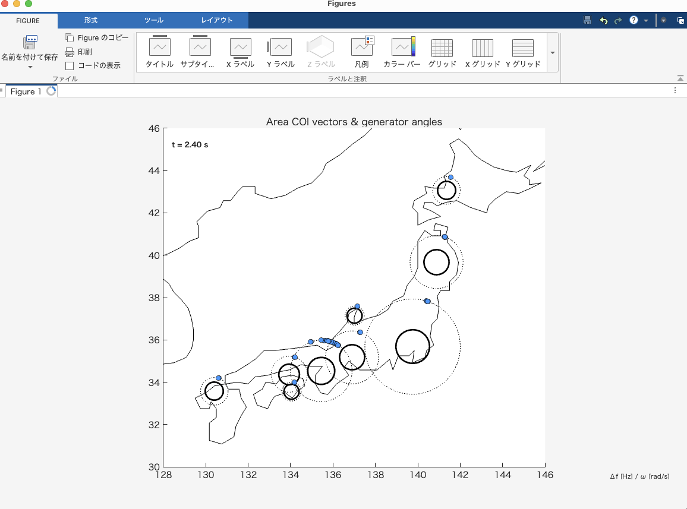

# Japan_Swing

日本の10エリア（北海道〜沖縄）の電力系統における連成スイング（同期安定性）をシミュレーションするプログラムです。



## 概要

このプロジェクトは、日本の電力系統を10の地域エリアに分割し、各エリア内の発電機群の動的な挙動を連成スイング方程式で解析します。地理的な位置情報と合わせて、リアルタイムで同期安定性を可視化できます。

## 機能

- 🗾 **10エリア連成解析**: 北海道から沖縄まで日本全国の電力系統をモデル化
- ⚡ **可変発電機台数**: エリア別に発電機台数を自由に設定可能
- 🎯 **擾乱シミュレーション**: 任意のエリア・発電機への擾乱投入でシステム応答を解析
- 📊 **リアルタイム可視化**: 地理マップ上でCOIベクトルと発電機角度を動的表示
- 📋 **Excelパラメータ管理**: 直感的なテンプレートでシステムパラメータを調整

## ファイル構成

```
Japan_Swing/
├── ex_fig/
│   └── image.png                       # シミュレーション結果例（可視化図）
├── matlab/
│   ├── simulate_area_network.m         # メインシミュレーションスクリプト
│   ├── generate_area_template.py       # Excelテンプレート生成スクリプト
│   ├── area_parameters_template.xlsx   # パラメータ設定ファイル
│   └── ~$area_parameters_template.xlsx # Excelテンポラリファイル
└── README.md
```

## 🚀 使用方法

### 1. 環境要件

- **MATLAB** (Curve Fitting Toolbox、Mapping Toolboxが推奨)
- **Python 3.x** (pandas, xlsxwriter) - テンプレート生成用

### 2. 実行手順

1. **パラメータテンプレート生成**（初回のみ）
   ```bash
   cd matlab
   python generate_area_template.py
   ```

2. **シミュレーション実行**
   ```matlab
   cd matlab
   simulate_area_network
   ```

3. **実行時の設定**
   - 可視化対象エリアを選択
   - 擾乱を投入するエリアと発電機番号を指定
   - 擾乱量（$\Delta\delta$ [rad]）を設定

### 3. パラメータ調整

`area_parameters_template.xlsx`を編集することで以下のパラメータを調整できます：

- `Generator_Count`: エリア内発電機台数
- `p_m`: 機械的入力パワー $P_m$
- `b`: 同期化力係数 $B$
- `b_int`: エリア内結合係数 $B_{int}$
- `epsilon`: エリア間結合強度 $\varepsilon$
- `Connection_Coeff`: エリア間接続係数

## 📈 シミュレーション詳細

### モデル

各発電機の動特性は以下の連成スイング方程式で表現されます：

$$
\begin{align}
\frac{d\delta}{dt} &= \omega \\
\frac{d\omega}{dt} &= P_m - B \sin(\delta) - B_{int}[\sin(\delta-\delta_{prev}) + \sin(\delta-\delta_{next})] - \varepsilon B_{int} g
\end{align}
$$

ここで：
- $\delta$: 発電機角度 [rad]
- $\omega$: 角速度 [rad/s]
- $P_m$: 機械的入力パワー [p.u.]
- $B$: 同期化力係数 [p.u.]
- $B_{int}$: エリア内結合係数 [p.u.]
- $\varepsilon$: エリア間結合強度 [p.u.]
- $g$: エリア間相互作用項 [p.u.]

### 可視化


シミュレーションでは以下の要素がリアルタイムで可視化されます：

- **日本地図**: 各エリアの地理的位置を表示
- **エリア中心**: 黒い四角で各エリアの重心位置を表示
- **COIベクトル**: 各エリアの平均的な動的状態（角速度と位相）をベクトルで表示
- **発電機角度**: 青い点で各発電機の個別角度を円周上に表示
- **エリア間結合**: 点線で隣接エリア間の電力潮流を表示
- **時間表示**: 左上にシミュレーション時刻を表示

図の例では、t=2.40秒時点での各エリアの同期状態が示されており、擾乱により一部のエリアで位相が変動している様子が確認できます。

## 📚 参考文献

本プロジェクトの理論的基盤は以下の研究に基づいています：

**Susuki, Y., & Mezić, I.** (2011). Nonlinear Koopman modes and coherency identification of coupled swing dynamics. *Journal of Nonlinear Science*, 21(4), 567-593. 
[DOI: 10.1007/s00332-010-9087-5](https://link.springer.com/article/10.1007/s00332-010-9087-5)

この論文では、結合スイング動力学における非線形Koopmanモードとコヒーレンシー同定について詳述されており、本シミュレーションの数学的モデルの理論的根拠となっています。

## 📄 ライセンス

このプロジェクトはMITライセンスの下で公開されています。

## ⚠️ 注意事項

- 本シミュレーションは学術・研究目的で作成されており、実際の電力系統運用とは異なります
- パラメータ値は例示的なものであり、実系統データではありません
- シミュレーション結果は教育・研究用途に限定してご利用ください