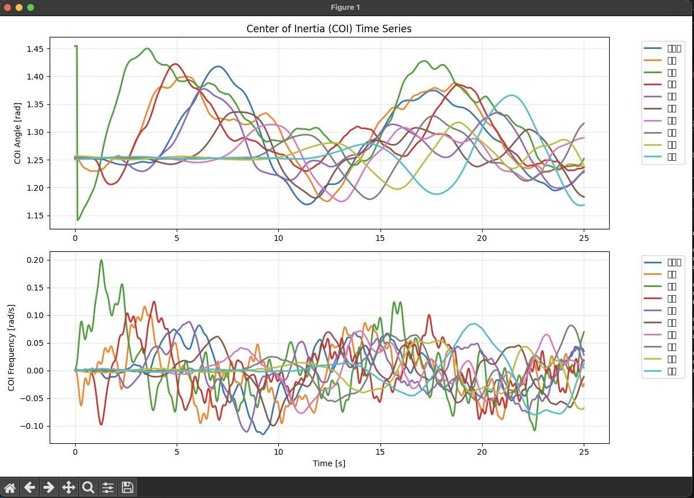

# Japan_Swing

日本の10エリア（北海道〜沖縄）の電力系統における連成スイング（同期安定性）をシミュレーションするプログラムです。

## 概要

このプロジェクトは、日本の電力系統を10の地域エリアに分割し、各エリア内の発電機群の動的な挙動を連成スイング方程式で解析します。地理的な位置情報と合わせて、リアルタイムで同期安定性を可視化できます。

## 機能

- 10エリア（北海道、東北、東京、北陸、中部、関西、中国、四国、九州、沖縄）の連成解析
- エリア別の発電機台数設定（可変対応）
- 任意のエリア・発電機への擾乱投入
- 地理マップ上でのCOI（Center of Inertia）ベクトルと発電機角度の可視化
- Excelテンプレートによるパラメータ管理

## ファイル構成

```
Japan_Swing/
├── matlab/
│   ├── simulate_area_network.m         # メインシミュレーションスクリプト
│   ├── generate_area_template.py       # Excelテンプレート生成スクリプト
│   ├── area_parameters_template.xlsx   # パラメータ設定ファイル
│   └── ~$area_parameters_template.xlsx # Excelテンポラリファイル
└── README.md
```

## 使用方法

### 1. 環境要件

- MATLAB (Curve Fitting Toolbox、Mapping Toolboxが推奨)
- Python 3.x (pandas, xlsxwriter) - テンプレート生成用

### 2. 実行手順

1. **パラメータテンプレート生成**（初回のみ）
   ```bash
   cd matlab
   python generate_area_template.py
   ```

2. **シミュレーション実行**
   ```matlab
   cd matlab
   simulate_area_network
   ```

3. **実行時の設定**
   - 可視化対象エリアを選択
   - 擾乱を投入するエリアと発電機番号を指定
   - 擾乱量（$\Delta\delta$ [rad]）を設定

### 3. パラメータ調整

`area_parameters_template.xlsx`を編集することで以下のパラメータを調整できます：

- `Generator_Count`: エリア内発電機台数
- `p_m`: 機械的入力パワー $P_m$
- `b`: 同期化力係数 $B$
- `b_int`: エリア内結合係数 $B_{int}$
- `epsilon`: エリア間結合強度 $\varepsilon$
- `Connection_Coeff`: エリア間接続係数

## シミュレーション詳細

### モデル

各発電機の動特性は以下の連成スイング方程式で表現されます：

$$
\begin{align}
\frac{d\delta}{dt} &= \omega \\
\frac{d\omega}{dt} &= P_m - B \sin(\delta) - B_{int}[\sin(\delta-\delta_{prev}) + \sin(\delta-\delta_{next})] - \varepsilon B_{int} g
\end{align}
$$

ここで：
- $\delta$: 発電機角度 [rad]
- $\omega$: 角速度 [rad/s]
- $P_m$: 機械的入力パワー [p.u.]
- $B$: 同期化力係数 [p.u.]
- $B_{int}$: エリア内結合係数 [p.u.]
- $\varepsilon$: エリア間結合強度 [p.u.]
- $g$: エリア間相互作用項 [p.u.]

### 可視化

シミュレーションでは以下の要素をリアルタイムで可視化します：

- **日本地図**: 10エリアの地理的な位置関係を表示
- **COI（Center of Inertia）ベクトル**: 各エリアの平均的な動的状態をベクトルで表示
- **発電機角度**: 個別発電機の位相角を円周上の点で表現
- **擾乱の伝播**: エリア間での動揺の伝播過程を動画で観察可能


*図: 日本の10エリア電力系統における連成スイング現象の可視化例。各エリアのCOIベクトルと発電機角度の時間変化を示している。*

## 参考文献

1. Susuki, Y., & Mezić, I. (2009). Nonlinear Koopman modes and coherency identification of coupled swing dynamics. IEEE Transactions on Power Systems, 26(4), 1894-1904.

## ライセンス

このプロジェクトはMITライセンスの下で公開されています。

## 注意事項

- 本シミュレーションは学術・研究目的で作成されており、実際の電力系統運用とは異なります
- パラメータ値は例示的なものであり、実系統データではありません